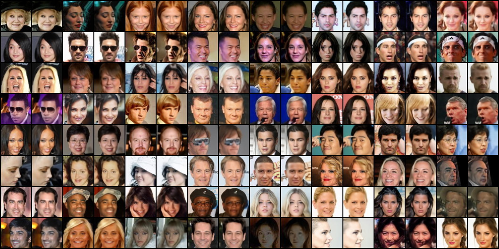
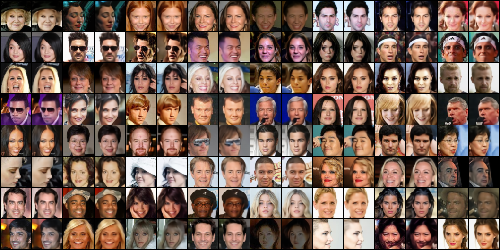
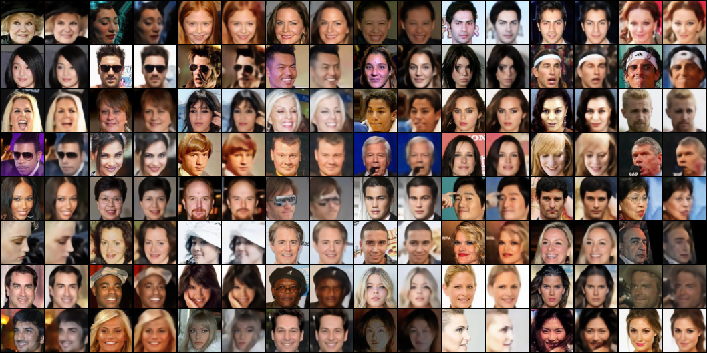
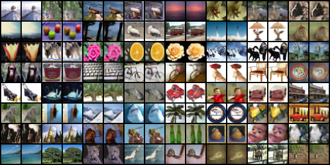
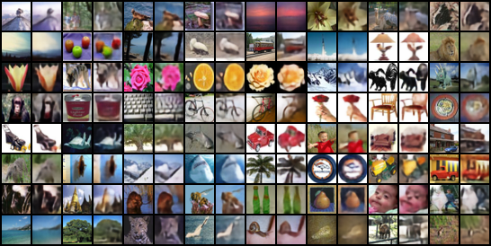
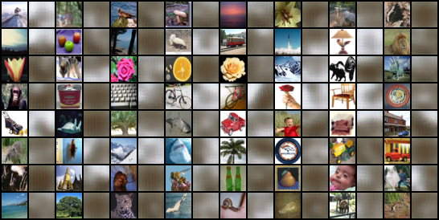

# MO-VAE

A multi-objective representation learning approach for variational autoencoders (VAE, Beta TC-VAE, VQ-VAE) that stabilizes gradients by decomposing the evidence lower bound (ELBO) into complementary objectives.
We leverage multi-task gradient aggregation strategies—`jd_sum` and `UPGrad`—to jointly optimize reconstruction error and latent space regularization terms while keeping gradient updates conflict-free.

## Results

### CelebA VQ-VAE

| Sum (Baseline) | UPGrad | AlignedMTL |
|:--------------:|:------:|:----------:|
|  |  |  |

### CIFAR100 VQ-VAE

| Sum (Baseline) | UPGrad | AlignedMTL |
|:--------------:|:------:|:----------:|
|  |  |  |

## Requirements

- Python 3.10+
- CUDA 12.8+ (for GPU support)
- 8GB+ GPU memory recommended

## Installation

### 1. Clone the repository
```bash
git clone https://github.com/rkhosroshahi/MO-VAE
cd MO-VAE
```

### 2. Create virtual environment
```bash
python3 -m venv .venv
```

Activate the environment:
- **Linux/macOS**: `source .venv/bin/activate`
- **Windows**: `.venv\Scripts\activate`

### 3. Install dependencies
```bash
pip install -r requirements.txt
```

> **Note**: The requirements include PyTorch with CUDA 12.8. If you have a different CUDA version, install PyTorch separately from [pytorch.org](https://pytorch.org/get-started/locally/).

## Setup

### Datasets

Datasets are automatically downloaded to `./data/` on first run. Supported datasets:
- **CIFAR100**: 60,000 32x32 color images in 100 classes
- **CelebA**: 200,000+ celebrity face images (resized to 64x64)

To use a custom data directory:
```bash
python main.py --data_dir /path/to/data ...
```

### Weights & Biases (WandB)

This project uses [WandB](https://wandb.ai) for experiment tracking.

#### 1. Create a WandB account
Sign up at [wandb.ai](https://wandb.ai/signup)

#### 2. Login to WandB
```bash
wandb login
```
Enter your API key when prompted (find it at [wandb.ai/authorize](https://wandb.ai/authorize)).

#### 3. WandB arguments
| Argument | Description | Default |
|----------|-------------|---------|
| `--use_wandb` | Enable WandB logging | `False` |
| `--wandb_project` | Project name | `mo-vae` |
| `--wandb_entity` | Team/username | `None` (personal) |
| `--wandb_name` | Run name | `None` (auto-generated) |
| `--wandb_tags` | Tags for filtering | `None` |

#### Training without WandB
Simply omit the `--use_wandb` flag:
```bash
python main.py --dataset cifar100 --arch vae --epochs 100 --agg upgrad ...
```

### Configuration Options

| Argument | Description | Default |
|----------|-------------|---------|
| `--dataset` | Dataset (`cifar100`, `celeba`) | `CIFAR10` |
| `--arch` | Architecture (`vae`, `betatc_vae`, `vq_vae`) | `vae` |
| `--agg` | Aggregator (`jd_sum`, `upgrad`) | `None` (sum) |
| `--epochs` | Training epochs | `50` |
| `--batch_size` | Batch size | `128` |
| `--lr` | Learning rate | `0.001` |
| `--optimizer` | Optimizer (`adam`, `adamw`, `sgd`) | `adam` |
| `--latent_dim` | Latent dimension (VAE, BetaTCVAE) | `128` |
| `--hidden_dims` | Encoder/decoder channels | `[32,64,128,256,512]` |
| `--embedding_dim` | VQ-VAE embedding dimension | `64` |
| `--num_embeddings` | VQ-VAE codebook size | `512` |
| `--recons_dist` | Reconstruction loss (`bernoulli`, `gaussian`) | `gaussian` |
| `--recons_reduction` | Loss reduction (`mean`, `sum`) | `mean` |
| `--normalize` | Normalize input images | `False` |
| `--device` | Device (`cuda:0`, `cpu`) | Auto-detect |
| `--save_path` | Output directory | `logs/` |
| `--save_freq` | Save samples every N epochs | `10` |
| `--seed` | Random seed for reproducibility | `None` |

## Usage

### VAE

* Train VAE on CIFAR100 with jd_sum
```
python main.py --dataset cifar100 --arch vae --epochs 100 --agg jd_sum --optimizer adamw --lr 0.001 --save_freq 10 --latent_dim 128 --hidden_dims 32 64 128 256 512 --recons_dist bernoulli --recons_reduction mean --loss_weights 1.0 0.00025 --use_wandb --wandb_name "VAE CIFAR100 jd_sum"
```
* Train VAE on CIFAR100 with UPGrad
```
python main.py --dataset cifar100 --arch vae --epochs 100 --agg upgrad --optimizer adamw --lr 0.001 --save_freq 10 --latent_dim 128 --hidden_dims 32 64 128 256 512 --recons_dist bernoulli --recons_reduction mean --loss_weights 1.0 0.00025 --use_wandb --wandb_name "VAE CIFAR100 upgrad"
```
* Train VAE on CelebA with jd_sum
```
python main.py --dataset celeba --arch vae --epochs 100 --agg jd_sum --optimizer adamw --lr 0.001 --save_freq 10 --latent_dim 128 --hidden_dims 32 64 128 256 512 --recons_dist bernoulli --recons_reduction mean --loss_weights 1.0 0.00025 --use_wandb --wandb_name "VAE CelebA jd_sum"
```
* Train VAE on CelebA with UPGrad
```
python main.py --dataset celeba --arch vae --epochs 100 --agg upgrad --optimizer adamw --lr 0.001 --save_freq 10 --latent_dim 128 --hidden_dims 32 64 128 256 512 --recons_dist bernoulli --recons_reduction mean --loss_weights 1.0 0.00025 --use_wandb --wandb_name "VAE CelebA upgrad"
```

### Beta TC-VAE

* Train Beta TC-VAE on CIFAR100 with jd_sum
```
python main.py --dataset cifar100 --arch betatc_vae --epochs 100 --agg jd_sum --optimizer adamw --lr 0.001 --save_freq 10 --latent_dim 128 --recons_dist bernoulli --recons_reduction mean --loss_weights 1.0 1.0 1.0 1.0 --use_wandb --wandb_name "BetaTCVAE CIFAR100 jd_sum"
```
* Train Beta TC-VAE on CIFAR100 with UPGrad
```
python main.py --dataset cifar100 --arch betatc_vae --epochs 100 --agg upgrad --optimizer adamw --lr 0.001 --save_freq 10 --latent_dim 128 --recons_dist bernoulli --recons_reduction mean --loss_weights 1.0 1.0 1.0 1.0 --use_wandb --wandb_name "BetaTCVAE CIFAR100 upgrad"
```
* Train Beta TC-VAE on CelebA with jd_sum
```
python main.py --dataset celeba --arch betatc_vae --epochs 100 --agg jd_sum --optimizer adamw --lr 0.001 --save_freq 10 --latent_dim 128 --recons_dist bernoulli --recons_reduction mean --loss_weights 1.0 1.0 1.0 1.0 --use_wandb --wandb_name "BetaTCVAE CelebA jd_sum"
```
* Train Beta TC-VAE on CelebA with UPGrad
```
python main.py --dataset celeba --arch betatc_vae --epochs 100 --agg upgrad --optimizer adamw --lr 0.001 --save_freq 10 --latent_dim 128 --recons_dist bernoulli --recons_reduction mean --loss_weights 1.0 1.0 1.0 1.0 --use_wandb --wandb_name "BetaTCVAE CelebA upgrad"
```

### VQ-VAE

* Train VQ-VAE on CIFAR100 with jd_sum
```
python main.py --dataset cifar100 --arch vq_vae --epochs 100 --agg jd_sum --optimizer adamw --lr 3e-4 --save_freq 10 --embedding_dim 64 --num_embeddings 512 --recons_dist bernoulli --recons_reduction mean --loss_weights 1.0 1.0 0.25 --use_wandb --wandb_name "VQ-VAE CIFAR100 jd_sum"
```
* Train VQ-VAE on CIFAR100 with UPGrad
```
python main.py --dataset cifar100 --arch vq_vae --epochs 100 --agg upgrad --optimizer adamw --lr 3e-4 --save_freq 10 --embedding_dim 64 --num_embeddings 512 --recons_dist bernoulli --recons_reduction mean --loss_weights 1.0 1.0 0.25 --use_wandb --wandb_name "VQ-VAE CIFAR100 upgrad"
```
* Train VQ-VAE on CelebA with jd_sum
```
python main.py --dataset celeba --arch vq_vae --epochs 100 --agg jd_sum --optimizer adamw --lr 3e-4 --save_freq 10 --embedding_dim 64 --num_embeddings 512 --recons_dist bernoulli --recons_reduction mean --loss_weights 1.0 1.0 0.25 --use_wandb --wandb_name "VQ-VAE CelebA jd_sum"
```
* Train VQ-VAE on CelebA with UPGrad
```
python main.py --dataset celeba --arch vq_vae --epochs 100 --agg upgrad --optimizer adamw --lr 3e-4 --save_freq 10 --embedding_dim 64 --num_embeddings 512 --recons_dist bernoulli --recons_reduction mean --loss_weights 1.0 1.0 0.25 --use_wandb --wandb_name "VQ-VAE CelebA upgrad"
```
<!-- CONTACT -->
## Contact
Rasa Khosrowshahli - rkhosrowshahli@brocku.ca

## Citation
If you find this repository helpful, please cite it as:
```
@misc{khosrowshahli2025movae,
  title        = {Multi-Objective Variational Autoencoders},
  author       = {Rasa Khosrowshahli},
  year         = {2025},
  howpublished = {\url{https://github.com/rkhosroshahi/MO-VAE}},
}
```