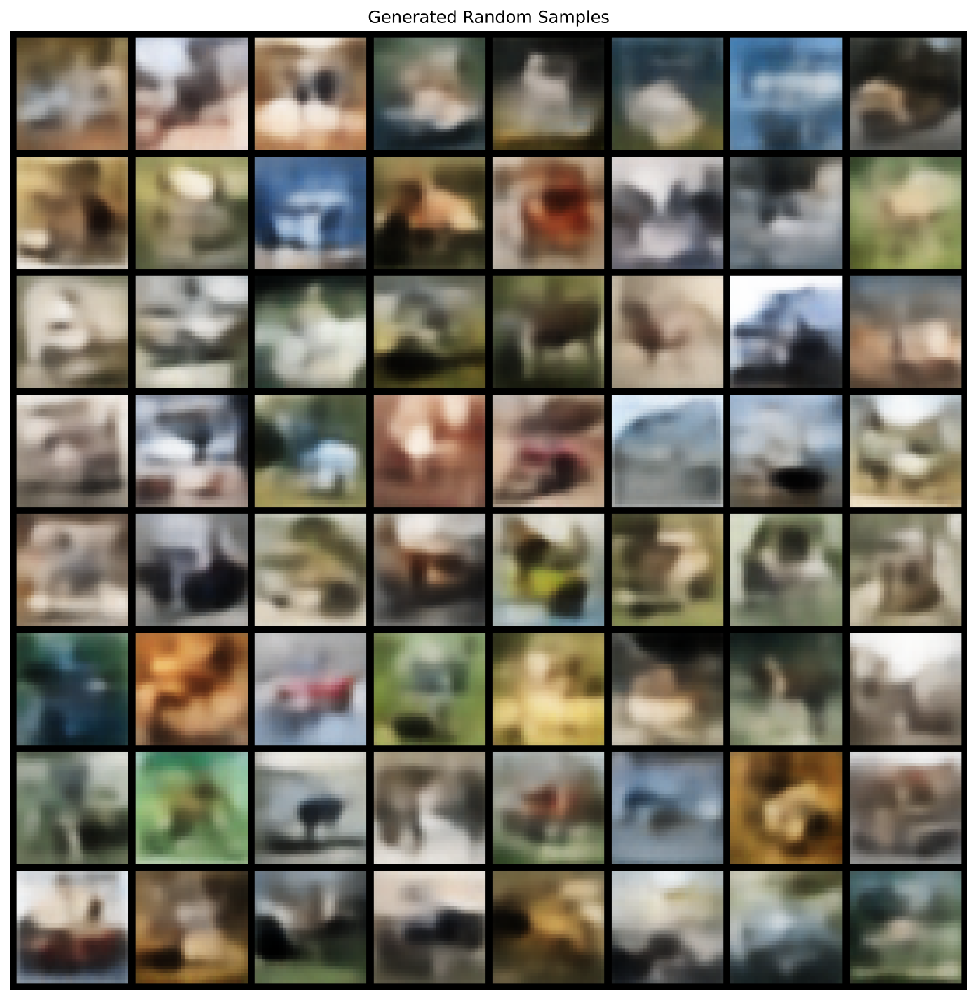
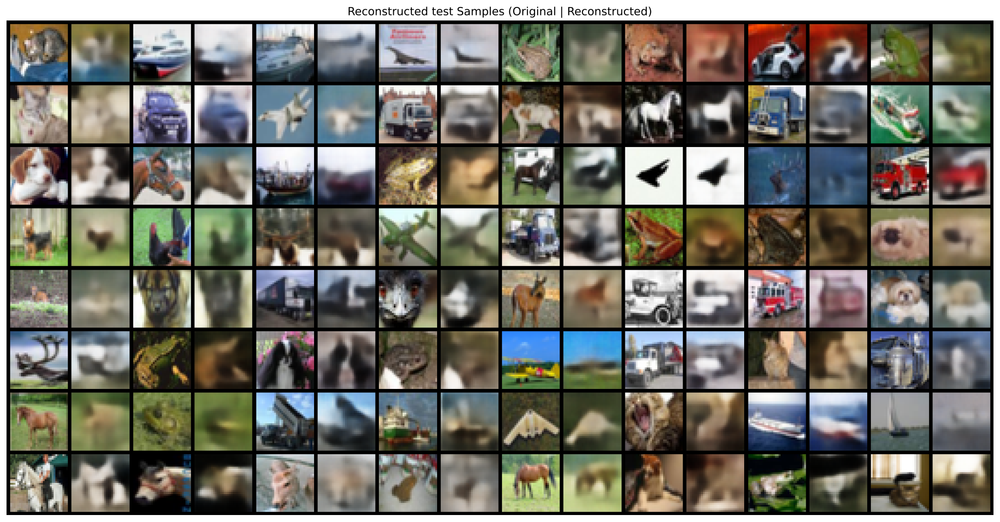
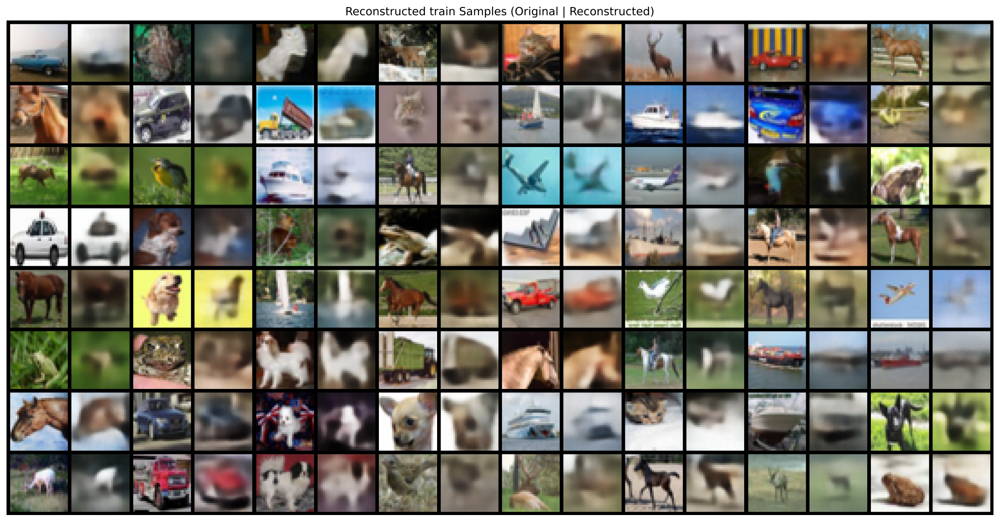

# MO-VAE



A multi-objective representation learning approach for variational autoencoders that stabilizes gradients by decomposing the evidence lower bound (ELBO) into two complementary objectives.
We explore a suite of multi-task gradient aggregation strategies—such as AlignedMTL, PCGrad, MGDA, and NashMTL—to jointly optimize the reconstruction error and KL divergence while keeping their gradient updates conflict-free.
## Installation
* Close the repository
```
git clone https://github.com/rkhosroshahi/MO-VAE
cd MO-VAE
```
* Let's create virtual environment (venv) in the project and install necessary packages using ```pip```.
```
python3 -m venv .venv
source .venv/bin/activate
pip install -r requirements.txt
```

<!-- USAGE EXAMPLES -->
## Usage
* Train VAE on CIFAR10 with aligned-mtl
```
python main.py --dataset cifar10 --epochs 200 --agg aligned_mtl --optimizer adamw --lr 0.001 --save_freq 10 --latent_dim 128 --hidden_dims 32 64 128 --objs mse_sum kl_mean --output_activation tanh --normalize --use_wandb --wandb_name "128d mse_sum + kl_mean tanh amtl"
```
* Train VAE on CIFAR10 with UPGrad
```
python main.py --dataset cifar10 --epochs 200 --agg upgrad --optimizer adamw --lr 0.001 --save_freq 10 --latent_dim 128 --hidden_dims 32 64 128 --objs mse_sum kl_mean --output_activation tanh --normalize --use_wandb --wandb_name "128d mse_sum + kl_mean tanh upgrad"
```
* Train VQ-VAE on CIFAR10
```
python main.py --dataset cifar10  --arch vq_vae --epochs 200 --agg aligned_mtl --optimizer adamw --lr 0.001 --save_freq 10 --use_wandb --wandb_name "vq_vae emb_dim=64 num_emb=512 w/o activation" --embedding_dim 64 --num_embedding 512 --objs mse_sum --output_activation none --normalize
```
* Train VQ-VAE on CIFAR10 with tanh output activation and normalize dataset
```
python main.py --dataset cifar10  --arch vq_vae --epochs 200 --agg aligned_mtl --optimizer adamw --lr 0.001 --save_freq 10 --use_wandb --wandb_name "vq_vae emb_dim=64 num_emb=512 tanh" --embedding_dim 64 --num_embedding 512 --objs mse_mean --output_activation tanh --normalize --beta 0.25
```
<!-- CONTACT -->
## Contact
Rasa Khosrowshahli - rkhosrowshahli@brocku.ca

## Citation
If you find this repository helpful, please cite it as:
```
@misc{khosrowshahli2025aligned,
  title        = {Multi-Objective Variational Autoencoders},
  author       = {Rasa Khosrowshahli},
  year         = {2025},
  howpublished = {\url{https://github.com/rkhosroshahi/MO-VAE}},
}
```