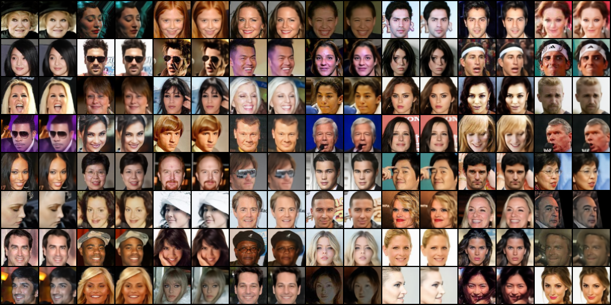
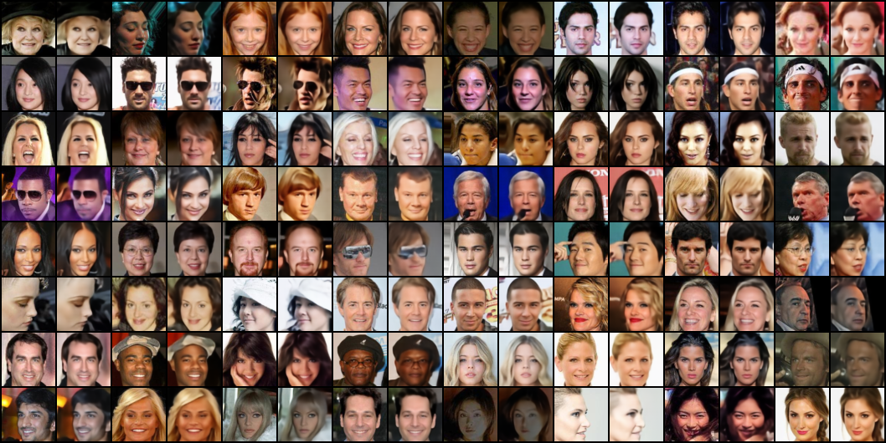
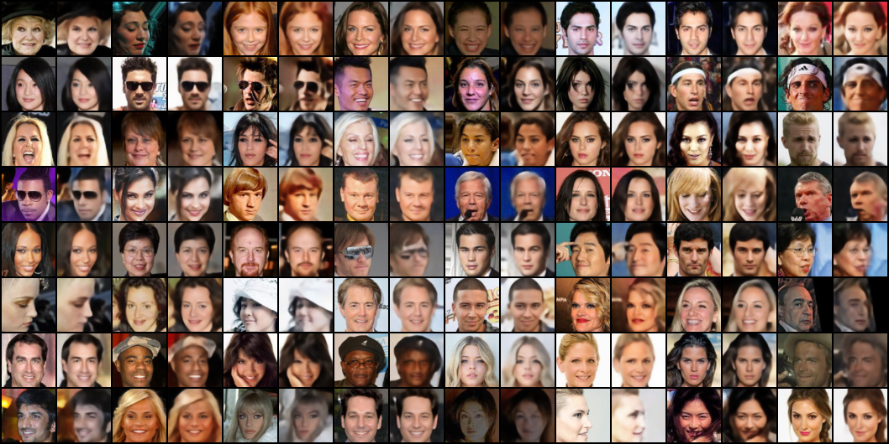
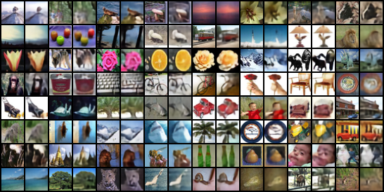
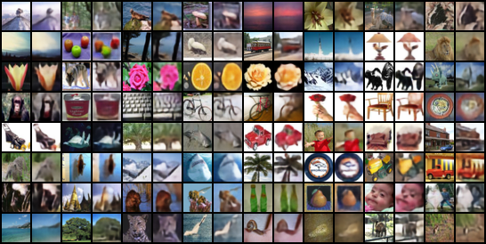
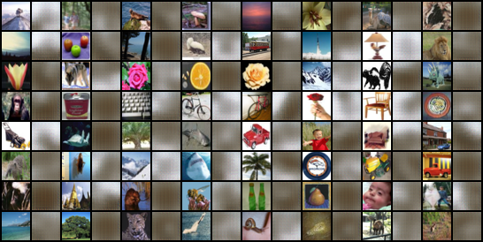

# MO-VAE

A multi-objective representation learning approach for variational autoencoders (VAE, Beta-TC-VAE, VQ-VAE, VQ-VAE2, GG-VAE, GG-VQ-VAE) that stabilizes gradients by decomposing the evidence lower bound (ELBO) into complementary objectives.
We leverage multi-task gradient aggregation strategies—`sum`, `UPGrad`, `MGDA`, `Aligned-MTL`, `COMFORT`—to jointly optimize reconstruction error and latent space regularization terms while keeping gradient updates conflict-free.

## Quick Start

```bash
pip install -r requirements.txt
python main.py --dataset cifar10 --arch vae --epochs 50 --agg sum --use_wandb
```

For VQ-VAE with PixelCNN prior (enables generation + gFID/IS/KID):
```bash
python main.py --dataset cifar10 --arch vq_vae --epochs 50 --agg sum --use_wandb
```

## Results

### CelebA VQ-VAE

| Sum (Baseline) | UPGrad | AlignedMTL |
|:--------------:|:------:|:----------:|
|  |  |  |

### CIFAR100 VQ-VAE

| Sum (Baseline) | UPGrad | AlignedMTL |
|:--------------:|:------:|:----------:|
|  |  |  |

## Requirements

- Python 3.10+
- CUDA 12.8+ (for GPU support)
- 8GB+ GPU memory recommended
- `lmdb` (for pre-extracted VQ codes on ImageNet; installs via `requirements.txt`)

## Installation

### 1. Clone the repository
```bash
git clone https://github.com/rkhosroshahi/MO-VAE
cd MO-VAE
```

### 2. Create virtual environment
```bash
python3 -m venv .venv
```

Activate the environment:
- **Linux/macOS**: `source .venv/bin/activate`
- **Windows**: `.venv\Scripts\activate`

### 3. Install dependencies
```bash
pip install -r requirements.txt
```

> **Note**: The requirements include PyTorch with CUDA 12.8. If you have a different CUDA version, install PyTorch separately from [pytorch.org](https://pytorch.org/get-started/locally/).

## Project Structure

```
MO-VAE/
├── main.py              # Main training script (VAE + prior training for VQ models)
├── evaluate.py          # Evaluate checkpoint: load model, compute metrics
├── runner.py            # Run configs from YAML files
├── train_pixelcnn_vqvae.py      # Standalone PixelCNN prior training (VQ-VAE)
├── train_pixelcnn_vqvae2.py     # Standalone PixelCNN prior training (VQ-VAE2)
├── generate_samples_pixelcnn_vqvae.py   # Generate samples from VQ-VAE + prior
├── generate_samples_pixelcnn_vqvae2.py  # Generate samples from VQ-VAE2 + prior
├── models/              # VAE, VQ-VAE, PixelCNN, PixelSNAIL architectures
├── utils/               # Dataset loader, metrics, MTL aggregators, LMDB codes
├── configs/             # YAML configs per dataset/arch/aggregator
└── logs/                # Outputs: checkpoints, figures, LMDB codes cache
```

### Output Directory Layout

After training, outputs are saved under `save_path/<dataset>/<arch>/<optimizer>/<aggregator>/<timestamp>/`:
- `checkpoints/final_checkpoint.pth` – final model weights
- `figures/generated/` – random samples (during training + final with prior)
- `figures/reconstructed/` – original vs reconstructed comparisons
- `pixelcnn_prior/` or `pixelsnail_prior/` – trained prior checkpoint (VQ models only)
- `vq_codes_lmdb/<hash>/` – pre-extracted discrete codes (when LMDB enabled, e.g. ImageNet)

## Setup

### Datasets

Datasets are automatically downloaded to `./data/` on first run. Supported datasets:
- **CIFAR10 / CIFAR100**: 32×32 color images
- **CelebA**: 64×64 celebrity faces
- **CelebA-HQ**: 256×256 celebrity faces
- **Oxford-Flower-102**: 256×256 flower images (Hugging Face)
- **animal-face**, **afhq**: 256×256 animal faces
- **imagenet**: 256×256 ImageNet

To use a custom data directory:
```bash
python main.py --data_dir /path/to/data ...
```

### Weights & Biases (WandB)

This project uses [WandB](https://wandb.ai) for experiment tracking.

#### 1. Create a WandB account
Sign up at [wandb.ai](https://wandb.ai/signup)

#### 2. Login to WandB
```bash
wandb login
```
Enter your API key when prompted (find it at [wandb.ai/authorize](https://wandb.ai/authorize)).

#### 3. WandB arguments
| Argument | Description | Default |
|----------|-------------|---------|
| `--use_wandb` | Enable WandB logging | `False` |
| `--wandb_project` | Project name | `mo-vae` |
| `--wandb_entity` | Team/username | `None` (personal) |
| `--wandb_name` | Run name | `None` (auto-generated) |
| `--wandb_tags` | Tags for filtering | `None` |

#### Training without WandB
Omit the `--use_wandb` flag:
```bash
python main.py --dataset cifar100 --arch vae --epochs 100 --agg sum ...
```

### Configuration Options

| Argument | Description | Default |
|----------|-------------|---------|
| `--dataset` | Dataset (`cifar10`, `cifar100`, `celeba`, `celeba-hq`, `oxford-flower-102`, `animal-face`, `imagenet`) | `CIFAR10` |
| `--arch` | Architecture (`vae`, `betatc_vae`, `vq_vae`, `vq_vae2`, `gg_vae`, `gg_vq_vae`, `gg_vq_vae_v3`, `gg_vq_vae2`) | `vae` |
| `--agg` | Aggregator (`sum`, `upgrad`, `mgda_ln`, `mgda_gn`, `mgda_lgn`, `aligned_mtl`, `aligned_mtl_median`) | `sum` |
| `--epochs` | Training epochs | `50` |
| `--batch_size` | Batch size | `128` |
| `--lr` | Learning rate | `0.001` |
| `--optimizer` | Optimizer (`adam`, `adamw`, `sgd`) | `adam` |
| `--latent_dim` | Latent dimension (VAE, Beta-TC-VAE) | `128` |
| `--hidden_dims` | Encoder/decoder channels | `[32,64,128,256,512]` |
| `--embedding_dim` | VQ-VAE embedding dimension | `64` |
| `--num_embeddings` | VQ-VAE codebook size | `512` |
| `--recons_objective` | Reconstruction loss (`mse`, `bce`, `l1`, `smooth_l1`, `perceptual`) | `mse` |
| `--recons_activation` | Decoder activation (`tanh`, `sigmoid`, `none`) | Inferred from recons_objective |
| `--normalize_inputs` | Normalize inputs to [-1,1] (use with mse/l1 objectives) | `False` |
| `--num_vis_samples` | Samples per visualization grid | `4` |
| `--device` | Device (`cuda:0`, `cpu`) | Auto-detect |
| `--save_path` | Output directory | `logs/` |
| `--save_freq` | Save samples every N epochs | `10` |
| `--eval_freq` | Evaluate every N epochs | `1` |
| `--seed` | Random seed for reproducibility | `None` |
| `--max_fid_samples` | Max samples for rFID | `10000` |
| `--max_gen_metrics_samples` | Max samples for gFID, IS, KID | `10000` |

### Architectures

| Architecture | Description |
|--------------|-------------|
| `vae` | Standard VAE |
| `betatc_vae`, `btc_vae` | Beta-TC-VAE |
| `vq_vae` | Vector Quantized VAE |
| `vq_vae2` | Hierarchical VQ-VAE (top + bottom codes) |
| `gg_vae` | Gradient-guided VAE |
| `gg_vae_v2` … `gg_vae_v6` | GG-VAE with different edge-matching variants |
| `gg_vq_vae`, `gg_vq_vae_v1` | Gradient-guided VQ-VAE |
| `gg_vq_vae_v2` … `gg_vq_vae_v8` | GG-VQ-VAE variants |
| `gg_vq_vae2` | Gradient-guided VQ-VAE2 |
| `recursive_kl_vae` | Recursive KL VAE |
| `cycle_vae` | Cycle VAE |
| `recursive_cyclic_vae`, `rc_vae` | Recursive cyclic VAE |
| `sphere_encoder` | Sphere Encoder (arXiv:2602.15030) |
| `sphere_encoder_vit` | Sphere Encoder ViT |

### Aggregators

| Aggregator | Description |
|------------|-------------|
| `sum` | Simple sum of losses (baseline) |
| `mean` | Uniform task weighting |
| `upgrad` | UpGrad |
| `pcgrad` | PCGrad |
| `cagrad` | CAGrad |
| `nashmtl` | Nash-MTL |
| `dualproj` | DualProj |
| `imtlg` | IMTLG |
| `mgda`, `mgda_ln`, `mgda_gn`, `mgda_lgn` | MGDA variants |
| `aligned_mtl`, `amtl` | Aligned-MTL |
| `aligned_mtl_median` | Aligned-MTL (median scaling) |
| `nupgrad`, `pnupgrad` | NUPGrad / PNUPGrad |
| `comfort` | COMFORT |

### Evaluation Metrics

After training, the pipeline computes:

| Metric | Description |
|--------|-------------|
| **rFID** | Reconstruction FID (real vs reconstructed) |
| **PSNR** | Peak signal-to-noise ratio |
| **SSIM** | Structural similarity |
| **LPIPS** | Learned perceptual image patch similarity |
| **gFID** | Generative FID (real vs generated, VQ models need prior) |
| **IS** | Inception Score |
| **KID** | Kernel Inception Distance |
| **HV** | Hypervolume (multi-objective; logged during training) |

### YAML Configs & Runner

Configs are stored under `configs/<dataset>/<arch>/<aggregator>/<recons_objective>/`. Run via:
```bash
# Single config
python runner.py --f configs/oxford-flower-102/vq_vae2/sum/bce/config_1.yaml

# From file list (bce or mse configs)
python runner.py --file-list configs/oxford-flower-102/vq_vae2/bce_configs.txt
python runner.py --file-list configs/oxford-flower-102/vq_vae2/mse_configs.txt
```

## Usage

### VAE

```bash
# Train VAE on CIFAR100 with sum aggregator
python main.py --dataset cifar100 --arch vae --epochs 100 --agg sum --latent_dim 128 --recons_objective bce --recons_activation sigmoid --use_wandb --wandb_name "VAE CIFAR100 sum"

# Train VAE on CelebA with UPGrad
python main.py --dataset celeba --arch vae --epochs 100 --agg upgrad --latent_dim 128 --recons_objective bce --recons_activation sigmoid --use_wandb --wandb_name "VAE CelebA upgrad"
```

### Beta TC-VAE

```bash
python main.py --dataset cifar100 --arch betatc_vae --epochs 100 --agg upgrad --latent_dim 128 --recons_objective bce --recons_activation sigmoid --use_wandb --wandb_name "BetaTCVAE CIFAR100 upgrad"
```

### GG-VAE

```bash
python main.py --dataset cifar100 --arch gg_vae --epochs 100 --agg upgrad --latent_dim 128 --recons_objective bce --recons_activation sigmoid --use_wandb
```

### VQ-VAE / VQ-VAE2 / GG-VQ-VAE

```bash
# VQ-VAE with BCE
python main.py --dataset oxford-flower-102 --arch vq_vae --epochs 100 --agg upgrad --embedding_dim 64 --num_embeddings 512 --recons_objective bce --recons_activation sigmoid --use_wandb

# VQ-VAE2 (hierarchical)
python main.py --dataset oxford-flower-102 --arch vq_vae2 --epochs 100 --agg sum --embedding_dim 64 --num_embeddings 512 --recons_objective bce --recons_activation sigmoid --use_wandb

# GG-VQ-VAE2 (VQ-VAE2 + gradient-guided + edge-matching losses)
python main.py --dataset oxford-flower-102 --arch gg_vq_vae2 --epochs 100 --agg sum --embedding_dim 64 --num_embeddings 512 --recons_objective bce --recons_activation sigmoid --use_wandb

# ImageNet with PixelSNAIL prior + LMDB pre-extracted codes (faster prior training)
python main.py --dataset imagenet --arch gg_vq_vae2 --epochs 20 --prior_type pixelsnail --pixelcnn_epochs 150 --normalize_inputs --recons_objective mse --use_wandb
```

For MSE objectives, enable input normalization:
```bash
python main.py --dataset oxford-flower-102 --arch vq_vae2 --recons_objective mse --recons_activation tanh --normalize_inputs ...
```

### PixelCNN / PixelSNAIL Prior for VQ-VAE

VQ-VAE models cannot generate new samples without a prior over the discrete latent codes. After VQ-VAE training, the pipeline automatically trains a PixelCNN (or PixelSNAIL) prior and uses it for random sample generation and generative metrics (gFID, IS, KID).

| Argument | Description | Default |
|----------|-------------|---------|
| `--prior_type` | Prior type (`pixelcnn`, `pixelsnail`) | `pixelcnn` |
| `--skip_pixelcnn` | Skip prior training; use naive random sampling for gen metrics | `False` |
| `--pixelcnn_epochs` | Prior training epochs | `100` |
| `--pixelcnn_hidden_channels` | Prior hidden channels | `128` |
| `--pixelcnn_num_layers` | Prior residual layers (PixelCNN) or bottom prior layers (PixelSNAIL) | `15` |
| `--pixelcnn_lr` | Prior learning rate | `3e-4` |
| `--pixelcnn_temperature` | Sampling temperature for generation | `1.0` |
| `--pixelsnail_num_blocks` | PixelSNAIL: attention blocks | `8` |
| `--pixelsnail_num_res_blocks` | PixelSNAIL: residual blocks per layer | `2` |
| `--pixelsnail_num_heads` | PixelSNAIL: attention heads | `8` |
| `--pixelsnail_dropout` | PixelSNAIL: dropout rate | `0.1` |

**PixelSNAIL** adds causal self-attention to PixelCNN for better long-range dependencies (recommended for ImageNet):
```bash
python main.py --arch gg_vq_vae2 --dataset imagenet --prior_type pixelsnail --pixelcnn_epochs 150 ...
```

### Pre-extracted LMDB Codes (ImageNet)

For large datasets like ImageNet, codes can be pre-extracted once and stored in LMDB, then reused for fast prior training without re-running the VQ-VAE every epoch.

| Argument | Description | Default |
|----------|-------------|---------|
| `--prior_use_lmdb_codes` | Use pre-extracted LMDB codes for prior training | `True` |
| `--no_prior_lmdb_codes` | Disable LMDB; extract codes on-the-fly each batch | - |
| `--prior_force_extract_codes` | Force re-extraction even if LMDB cache exists | `False` |
| `--prior_lmdb_map_size_gb` | LMDB map size in GB (ImageNet: ~150) | `150` |

**Flow**: On first run, all training images are passed through the frozen VQ-VAE once; codes are saved to `save_root/vq_codes_lmdb/<config_hash>/`. Subsequent prior training loads from LMDB (no VQ-VAE forward passes).

Requires `lmdb` (in `requirements.txt`). Disable with `--no_prior_lmdb_codes` if you prefer on-the-fly extraction.

### Troubleshooting

- **CUDA OOM**: Reduce `--batch_size` or `--num_vis_samples`. For ImageNet, use `--batch_size 32` or lower.
- **NaNs with BCE**: Ensure `--recons_activation sigmoid` when using `--recons_objective bce`; avoid `--normalize_inputs` for BCE.
- **NaNs with MSE**: Enable `--normalize_inputs` for stable MSE/L1 training.
- **Prior training slow**: For ImageNet, LMDB codes (`--prior_use_lmdb_codes`, default) avoid re-encoding each epoch. Use `--prior_force_extract_codes` only if you changed the VQ model.

### Evaluating a Checkpoint

Use `evaluate.py` to load a saved checkpoint and compute reconstruction + generative metrics without re-training:

```bash
python evaluate.py --model_path path/to/final_checkpoint.pth --dataset imagenet --arch gg_vq_vae2
```

For VQ models, generative metrics use uniform code sampling (evaluate.py does not load the prior). For prior-based generation metrics, use `main.py` or the standalone `generate_samples_pixelcnn_*` scripts.

### Standalone PixelCNN Prior Training

To train the prior separately (e.g., with a different dataset or after loading a checkpoint):

```bash
# VQ-VAE (single-level)
python train_pixelcnn_vqvae.py --vqvae_checkpoint path/to/vqvae.pth --dataset cifar10 --epochs 100

# VQ-VAE2 (hierarchical)
python train_pixelcnn_vqvae2.py --vqvae2_checkpoint path/to/vqvae2.pth --dataset cifar10 --epochs 100
```

Generate samples from a trained prior:
```bash
python generate_samples_pixelcnn_vqvae.py --vqvae_checkpoint ... --prior_checkpoint ... --num_samples 64
python generate_samples_pixelcnn_vqvae2.py --vqvae2_checkpoint ... --prior_checkpoint ... --num_samples 64
```

<!-- CONTACT -->
## Contact
Rasa Khosrowshahli - rkhosrowshahli@brocku.ca

## Citation
If you find this repository helpful, please cite it as:
```
@misc{khosrowshahli2025movae,
  title        = {Multi-Objective Variational Autoencoders},
  author       = {Rasa Khosrowshahli},
  year         = {2025},
  howpublished = {\url{https://github.com/rkhosroshahi/MO-VAE}},
}
```